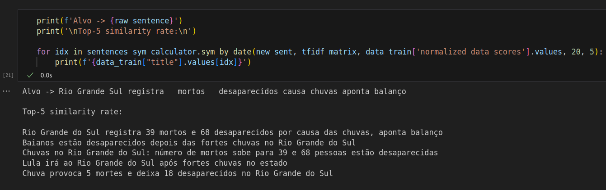

# agregador-de-noticias

Projeto final da discilpina de Eng. de Software da UFPB.

O objetivo é uma aplicação que agrega notícias e utiliza de um algoritmo de recomendação para agrupar e selecionar as melhores notícias para o usuário, com foco em velocidade, transparência e diminuir disseminação de fake news;

Link do documento de requisitos: https://docs.google.com/document/d/1o3a4nqXop7VNwn0WR4wYjhi8STWZKiQvjZXSwOQrL28/edit?usp=sharing

## Sistema de recomendação

O sistema recebe um conjunto de 9 notícias e gera 27 notícias recomendadas para cada uma das notícias principais (3 para cada):

### Funcionando



### Execução

`python3 -m venv .venv`

`source .venv\bin\activate`

`pip install -r requirements.txt`

`cd agregador-de-noticias/recommendation`

Cole em seu terminal:

```bash
python3 - << END
import sys
import pandas as pd

# Adicionar o diretório ao path do Python
sys.path.append('..')

# Importar as classes necessárias
from src.run_recommendation_system import RunRecomendationSystem
from utils.top_news_catcher import TopNewsCatcher

# Instanciar o TopNewsCatcher
top_news = TopNewsCatcher()

# Capturar as notícias principais
df_top_news, df_to_recommendations = top_news.catch_top_news("../dataset/notices.csv")

# Instanciar o RunRecomendationSystem
recomendation_system = RunRecomendationSystem()

print("Running...")

# Executar o sistema de recomendação
dataset_sentences, dataset_recommendations = recomendation_system.run(df_top_news, df_to_recommendations)

# Imprimir os resultados
print('\nNews Targets:\n')
print(dataset_sentences)
print('*'*100)
print('\nNews Recommended\n')
print(dataset_recommendations)
END
```